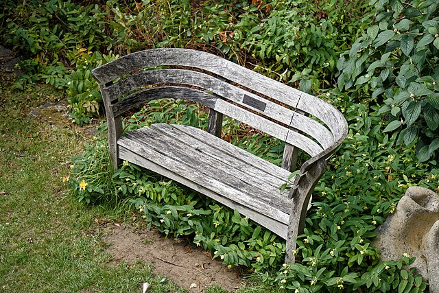

There are all kinds of green and growing things around here

<!-- Start of Image Embed - Float Right -->
<figure style="margin: 0 0 1rem 1rem; width: 42%; float: right; border: 1px solid #dee2e6; padding: 2px; border-radius: 0.25rem; box-sizing: border-box;">
    
    <figcaption style="font-size: 0.9em; color: #666; text-align: right; margin-top: 0.5rem;">
        

            
Show attribution

            <small>WikiCommons</small>
        

        Pick your own
    </figcaption>
</figure>

<!-- Mobile responsive adjustment -->

<!-- End of Image Embed - Float Right -->

### A digital pick-your-own for growing healthy churches

Come on in, simply because you are curious, or because you have a question you want to take further.   

You will find several different beds, where you can help yourself to whatever looks tasty.  

Let me know if you find anything to savour, and if you ideas about what else would be helpful to find here. You can reach me at: elgon@posteo.net

<!-- Start of Image Embed - Float Right -->
<figure style="margin: 0 0 1rem 1rem; width: 42%; float: right; border: 1px solid #dee2e6; padding: 2px; border-radius: 0.25rem; box-sizing: border-box;">
    
    <figcaption style="font-size: 0.9em; color: #666; text-align: right; margin-top: 0.5rem;">
        

            
Show attribution

            <small>ChatGPT</small>
        

        Summer fruit and veg
    </figcaption>
</figure>

<!-- Mobile responsive adjustment -->

<!-- End of Image Embed - Float Right -->

Fill your trug with as much as you can cook, or those around you can eat  

Check out growing guides, with suggestions that you can always ignore, and recipes from earlier years and other cultures.  There is nothing new under the sun, and there is certainly nothing new around here.  

Cook, chew, enjoy, feast together, as soon as you are ready.  

You could choose to plant, tend and look forward to harvest sometime later.  

<!-- Start of Image Embed - Float Right -->
<figure style="margin: 0 0 1rem 1rem; width: 42%; float: right; border: 1px solid #dee2e6; padding: 2px; border-radius: 0.25rem; box-sizing: border-box;">
    
    <figcaption style="font-size: 0.9em; color: #666; text-align: right; margin-top: 0.5rem;">
        

            
Show attribution

            <small>WikiCommons</small>
        

        A place to pause and pray
    </figcaption>
</figure>

<!-- Mobile responsive adjustment -->

<!-- End of Image Embed - Float Right -->

There is a bench at the centre, where you can pray before you dive in  

Enjoy.  

***

## Growing guides    

[[How to grow potatoes]]  
[[Potatoes]]  
[[Runner Beans]]   
[[Weedkillers]]  
[[What to do about slugs]]  
[[Where to grow beans]]  
