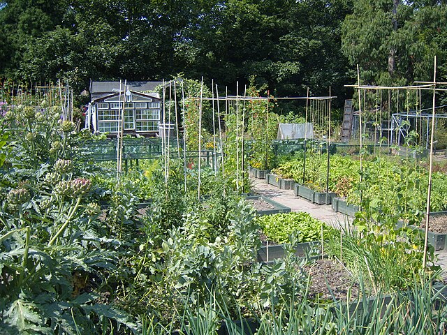
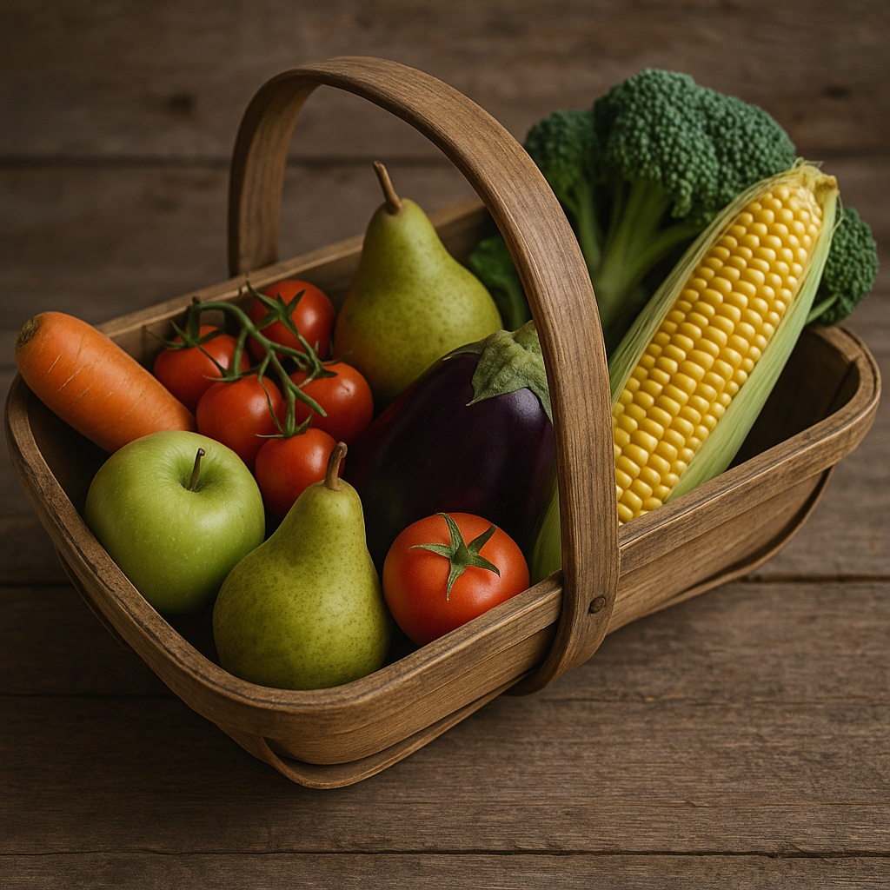

There are all kinds of green and growing things around here

### A digital pick-your-own for growing healthy churches
<!-- Start of Image Embed - Float Right -->
<figure style="margin: 0px 0px 1rem 1rem; width: 42%; float: right; border: 1px solid rgb(222, 226, 230); padding: 2px; border-radius: 0.25rem;">
    
    <figcaption style="font-size: 0.9em; color:#666; text-align: right">
      

Show attribution

        <small><a </a></small>
      
     
    </figcaption>
    </figure>
<!-- End of Image Embed - Float Right -->

Come on in, simply because you are curious, or because you have a question you want to take further.   

Fill your trug with as much as you can cook, or those around you can eat.    

You will find several different beds, where you can help yourself to whatever looks tasty.  

<!-- Start of Image Embed - Float Right -->
<figure style="margin: 0 0 1rem 1rem; width: 42%; float: right; border: 1px solid #dee2e6; padding: 2px; border-radius: 0.25rem;">
    
    <figcaption style="font-size: 0.9em; color: #666; text-align: right;">
        

            
Show attribution

            <small>ChatGPT</small>
        
Summer fruit and veg</figcaption>
</figure>
<!-- End of Image Embed - Float Right -->

There is a bench at the centre, where you can take time out to pray before you dive in.  

Check out growing guides, and recipes from earlier years and other cultures.  

Cook, chew, enjoy, feast together, or plant, tend and look forward to harvest sometime later.  

Enjoy.  

## How and what  

[[How to grow potatoes]]  
[[Potatoes]]  
[[Runner Beans]]   
[[Weedkillers]]  
[[What to do about slugs]]  
[[Where to grow beans]]  
